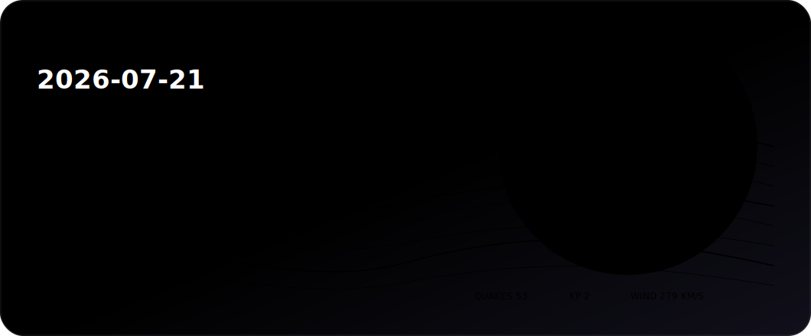
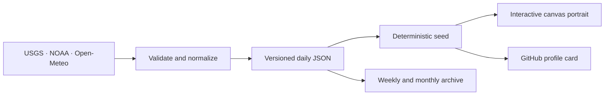

<div align="center">
  

  <h1>Earthloom · 地球织机</h1>
  <p><strong>The Earth weaves one portrait a day.</strong><br />地球每天用开放数据织出一幅自己的画像。</p>

  [](https://github.com/zhang987af/earthloom/actions/workflows/weave.yml)
  [](https://github.com/zhang987af/earthloom/actions/workflows/pages.yml)
  [](./LICENSE)
</div>

Earthloom turns earthquakes, space weather, global weather samples, and the lunar phase into a deterministic work of generative art. Every portrait is backed by a versioned JSON snapshot: the artwork is poetic, but its inputs are inspectable.

## What grows here

- **Daily portrait** — a new open-data artwork every day at 08:08 Asia/Shanghai.
- **Living gallery** — every snapshot stays addressable by date.
- **Weekly plate** — seven portraits become one collectible overview each Sunday.
- **Monthly record** — a compact signal report is published on the first day of each month.
- **Profile card** — [`public/cards/latest.svg`](./public/cards/latest.svg) always reflects the newest weave.
- **Interactive museum** — the canvas responds to pointer movement, supports reduced motion, and works on mobile.

## From signal to form

| Open signal | Visual role | Source |
| --- | --- | --- |
| Earthquakes M2.5+ | Ripples, nodes, opacity and scale | [USGS Earthquake Hazards Program](https://earthquake.usgs.gov/earthquakes/feed/) |
| Planetary K-index | Aurora intensity and thread density | [NOAA Space Weather Prediction Center](https://services.swpc.noaa.gov/) |
| Solar-wind speed | Motion tempo | [NOAA SWPC](https://services.swpc.noaa.gov/products/summary/) |
| Twelve global weather samples | Color temperature and flow direction | [Open-Meteo](https://open-meteo.com/) |
| Lunar phase | The portrait's visible and dark regions | Calculated locally from a known lunar epoch |



## Run the loom

Requires Node.js 22 or newer.

```bash
npm install
npm run weave
npm run dev
```

Useful commands:

```bash
npm run check          # type-check the application
npm run test           # verify data, portrait and automation contracts
npm run build          # build the hosted application
npm run build:pages    # export the GitHub Pages edition
npm run weave:weekly   # refresh the seven-day collection
npm run weave:monthly  # publish the previous month's report
```

## Put today's Earth on a profile

Add this to a GitHub profile README:

```md
[](https://zhang987af.github.io/earthloom/)
```

## Automation without empty commits

The scheduled workflow writes a commit only when the new snapshot changes tracked artifacts. A daily commit contains the source snapshot, archive entry, index and profile card; weekly and monthly commits contain their corresponding collection. No empty commits are created to manufacture activity.

The website is deployed separately, with the minimum `pages: write` and `id-token: write` permissions required by GitHub Pages. Data collection has only `contents: write` permission.

## Provenance and reuse

Application code is released under the [MIT License](./LICENSE). Source services retain their own terms; Open-Meteo data requires attribution under CC BY 4.0. Read [DATA_SOURCES.md](./DATA_SOURCES.md) before redistributing the archived observations.

Earthloom is an artwork and is not intended for earthquake warning, navigation, space-weather operations, or emergency decisions.
